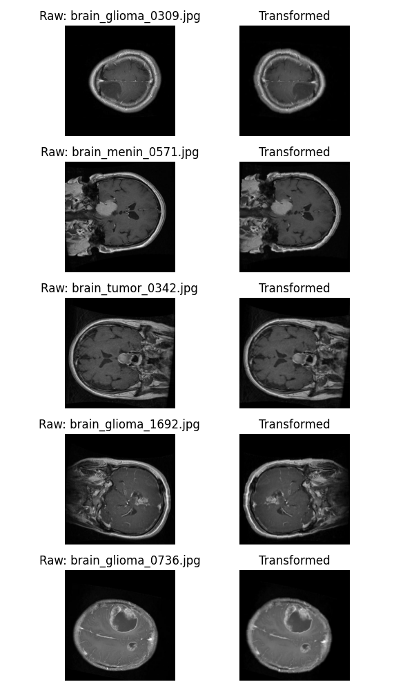
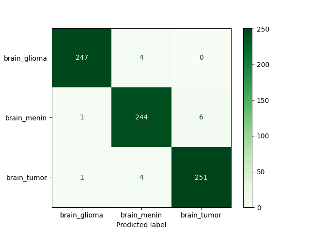

# Brain Cancer Classification from MRI Scans
This project builds a deep learning model to automatically detect and classify brain tumors from MRI images using convolutional neural networks (CNNs). 


# Table of Contents
- [Brain Cancer Classification from MRI Scans](#brain-cancer-classification-from-mri-scans)
- [Table of Contents](#table-of-contents)
  - [Project Overview](#project-overview)
  - [Dataset Description](#dataset-description)
  - [Model Architecture](#model-architecture)
  - [Evaluation](#evaluation)
    - [Detailed breakdown/Interpretation of metrics:](#detailed-breakdowninterpretation-of-metrics)
  - [Directory Structure](#directory-structure)
  - [Usage](#usage)
  - [Relevance of the project](#relevance-of-the-project)
  - [Future Work](#future-work)
  - [Author](#author)
  - [Acknowledgement](#acknowledgement)

## Project Overview
Early and accurate detection of brain cancer (tumors) is critical for patient prognosis and treatment planning. Manual inspection of MRI scans is time-consuming and subject to variability among radiologists.  
This project explores an automated approach to classify brain MRI images into different categories using deep learning.

The work includes:
- Data preprocessing  
- Image augmentation strategies suitable for medical imaging (applied to the training set)
- CNN-based classification model built in PyTorch.  
- Model evaluation and inference pipeline  
- Detailed visualization and documentation of results

## Dataset Description
- **Source:** [Brain Cancer MRI Dataset – Kaggle](https://www.kaggle.com/datasets/orvile/brain-cancer-mri-dataset)

The dataset contains MRI scans categorized into three classes:
- `Brain_Glioma:` 2004 images.
- `Brain_Menin:` 2004 images 
- `Brain_Tumor:` 2048 images

- Each image is an MRI slice showing brain tissue in different orientations and contrasts. 
- To ensure that the model had better genralization, we used the following data preprocessing steps
  - **Resizing:** All images were resized to 224 x 224 and converted to RGB format to get the three traditional image channels
  - **Augmentations:** For the training set, a couple of augmentations were applied. This was to make sure that the model sees (to a higher degree) all possible variabilities in the data. The specific augmentations applied include:
    - Random Horizontal flips
    - Random Rotations (5 degrees)
    - Random crop resizing ($\pm$ 0.05 of the original image)
    - Random contrasts adjustments (about 0.05)
  - As we can see, all of these augmentations are quite small because in as much we wish to increase the variability in the data for better model generalization, we also don't want to completely distort the datasets,  which might be extremely harmful in the case of medical imaging analysis. A picture of the raw images vs their transformed versions is shown in `Figure 1`.
  - **Normalization:** The per-channel mean and standard deviation (std) were computed from the training set and used to normalize the loaded datasets. This was to help the model training converge faster. Because the images were grayscale, all three channels had the same mean. Same for the standard deviation.
<figure>
    
    <figcaption>Figure 1: Raw images vs transformed images</figcaption>
</figure>


- The original datasets had not train, val and test sets hence a custom class was created to split the data into train, val and test sets, while keeping the per-class folder structure. The results were saved to `preprocessed/brain_cancer_mri_splits`, and the custom class used can be found in `src/data/data_splitter.py`.


## Model Architecture
The CNN model (`BrainScanCNN`) consists of:
- Convolutional + BatchNorm + ReLU blocks  
- MaxPooling layers  
- Fully connected layers  
- Softmax output layer for 3-class prediction  
- The optimizer used was the `Adam` optimizer.
- We used a standard `CrossEntropyLoss` function for training.
- Model architecture is given below.
```
==========================================================================================
Layer (type:depth-idx)                   Output Shape              Param #
==========================================================================================
BrainScanCNN                             [32, 3]                   --
├─Conv2d: 1-1                            [32, 16, 224, 224]        448
├─BatchNorm2d: 1-2                       [32, 16, 224, 224]        32
├─MaxPool2d: 1-3                         [32, 16, 112, 112]        --
├─Conv2d: 1-4                            [32, 32, 112, 112]        4,640
├─BatchNorm2d: 1-5                       [32, 32, 112, 112]        64
├─MaxPool2d: 1-6                         [32, 32, 56, 56]          --
├─Conv2d: 1-7                            [32, 64, 56, 56]          18,496
├─BatchNorm2d: 1-8                       [32, 64, 56, 56]          128
├─MaxPool2d: 1-9                         [32, 64, 28, 28]          --
├─Conv2d: 1-10                           [32, 128, 28, 28]         73,856
├─BatchNorm2d: 1-11                      [32, 128, 28, 28]         256
├─MaxPool2d: 1-12                        [32, 128, 14, 14]         --
├─Conv2d: 1-13                           [32, 256, 14, 14]         295,168
├─BatchNorm2d: 1-14                      [32, 256, 14, 14]         512
├─MaxPool2d: 1-15                        [32, 256, 7, 7]           --
├─Linear: 1-16                           [32, 256]                 3,211,520
├─BatchNorm1d: 1-17                      [32, 256]                 512
├─Linear: 1-18                           [32, 128]                 32,896
├─BatchNorm1d: 1-19                      [32, 128]                 256
├─Linear: 1-20                           [32, 3]                   387
==========================================================================================
==========================================================================================
Total params: 3,639,171
Trainable params: 3,639,171
Non-trainable params: 0
Total mult-adds (G): 8.25
==========================================================================================
Input size (MB): 19.27
Forward/backward pass size (MB): 796.59
Params size (MB): 14.56
Estimated Total Size (MB): 830.42
==========================================================================================
```


## Evaluation
- Accuracy, Precision, Recall, F1-score and ROC-AUC score
- Per-class confusion matrix  
- Visual inspection of of the confusion matrix. 

### Detailed breakdown/Interpretation of metrics:  
- Model performance can be summarized using four key outcomes:

  - **True Positive (TP):** The model correctly identifies that an image belongs to a specific class and that is true indeed.  
  - **True Negative (TN):** The model correctly identifies that an image does not belongs to a specific class and that is true indeed.  
  - **False Positive (FP):** The model incorrectly classifies that an image belongs to a specific class but that is untrue.  
  - **False Negative (FN):** The model fails to detect that an image belongs to that specific class when it infact belongs to that class.

- In medical imaging, **false negatives (FN)** are typically **more dangerous** than false positives (FP).  
A false negative means a tumor is missed (or misclassified), which can lead to delayed diagnosis and treatment.  
A false positive, while undesirable, usually results in additional testing and verification — an inconvenience rather than a medical risk.

- The full metrics can be found in `artifacts/results/metrics_test_eval_baseline_brain_cnn.json` under the `"metrics"` key.

The image of the classification matrix of the model's performance on the hold out test set is shown below (`Figure 2`).
<figure>
    
    <figcaption>Figure 2: Confusion matrix</figcaption>
</figure>


- From the confusion matrix, we can see that the model is performing extremely well on the test set.


## Directory Structure
- This shows the project organisation and files structure to make it easier to find relevant information.
```
├── artifacts/
│ ├── graphs/ # saved graphs from the project
│ ├── history/ # saved training history
│ ├── logs/ # Saved logs
│ ├── models/ # Saved trained models
│ ├── preprocessing/ # Saved normalization parameter values (mean and std)
│ └── results/ # Predictions, metrics (CSV, JSON)
├── configs/
│ └── config.yaml # Global configurations file analysis and training configurations
├── data/
│ └── Brain_Cancer/ Original dataset (grouped into subdirectories by class)
├── notebooks/
│ └── brain_mri_tumour_detection_cnn.ipynb # Notebook file (mostly with graphs) of analysis and results.
├── src/
│ ├── data/ # houses the classes and functions for data splitting, Pytorch Dataset creation and data loaders
│ ├── evaluation/ # Metrics used to evaluate model performance
│ ├── inference/ # Defines how to load new datasets for prediction and also contains the prediction function
│ ├── models/ # Creates the custom model architecture used in this project
│ ├── preprocessing/ # Contains functions used in data preprocessing
│ ├── training/ # Contains classes and functions for defining callbacks and training loops
│ ├── utils/ # Contains utility functions for setting up logging, loading and saving objects/results, and functions plots.
│ ├── __init__.py
│ └── main.py # entry point for the project (app)
└── README.md

```

## Usage
- Clone the project repo
  - if you use `HTTPS:`
    ```
        git clone https://github.com/Emmanuel-Afrifa/Brain-Cancer-MRI-Detection.git
    ```
  - If you use `SSH:`
    ```
        git clone git@github.com:Emmanuel-Afrifa/Brain-Cancer-MRI-Detection.git
    ```

- Change to the project directory
    ```
        cd path/to/Brain-Cancer-MRI-Detection/
    ```

- For training the model
    ```
    python -m src.main --mode train --config configs/config.yaml 
    ```
- For evaluation of the model performance on the hold out test set
    ```
    python -m src.main --mode eval --config configs/config.yaml
    ```

- For use of the trained model to make predictions
    ```
    python -m src.main --mode predict --config configs/config.yaml --input trial_predict_imgs
    ```

***NB: Here, `trial_predict_imgs` denotes the path of the directory that contains images to be predicted.***


## Relevance of the project
- **Early and Accurate Diagnosis:** Automated MRI-based brain tumor classification can assist radiologists in early detection, improving treatment outcomes and reducing diagnostic workload in resource-limited hospitals.

- **Reducing Human Error in Interpretation:** MRI scans require expert interpretation, which can vary across clinicians. This model provides consistent, data-driven predictions that support more objective clinical decisions.

- **Scalable Screening in Low-Resource Settings:**  In regions with limited access to radiology specialists, deploying such models could enable preliminary tumor screening, helping prioritize patients who need urgent expert review.


## Future Work
- Experiment with pre-trained models (e.g., ResNet, EfficientNet)
- Integrate Grad-CAM for interpretability of learned features
- Extend dataset to include non-tumor MRI scans (healthy controls)

## Author
- Emmanuel Afrifa
- [emmaquame9@gmail.com](mailto:emmaquame9@gmail.com)
- [Github](https://github.com/Emmanuel-Afrifa/)
- [X](https://x.com/Emma33712365)
- [Linkedin](https://www.linkedin.com/in/emmanuel-afrifa-840674214/)

## Acknowledgement
- [World Quant University](https://www.wqu.edu/)
- [Brain Cancer MRI Dataset](https://www.kaggle.com/datasets/orvile/brain-cancer-mri-dataset?resource=download)


